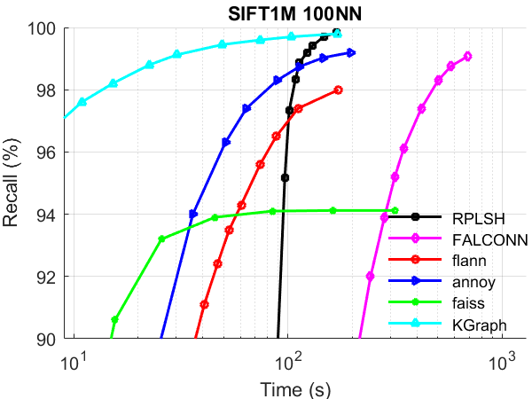
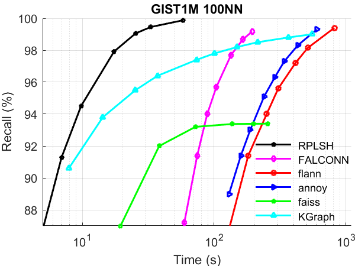

Random Projection based Locality Sensitive Hashing 
============
We provide here the codes for Random Projection based Locality Sensive Hashing (RPLSH). The algorithm is formally described in [1] and the matlab version can be found at [here](https://github.com/ZJULearning/MatlabFunc/tree/master/ANNS/Hashing)

RPLSH is extremely simple but rather effective. All the previous hashing papers failed to correctly measure the performance of hashing algorithms and the powerfulness of RPLSH was certainly underestimated.
Please see our paper [A Revisit of Hashing Algorithms for Approximate Nearest Neighbor Search](http://arxiv.org/abs/1612.07545) for details.

Benchmark data set
-------
* [SIFT1M and GIST1M](http://corpus-texmex.irisa.fr/)

The performance was tested without parallelism.   

ANN search results
------

     
    

How To Complie    
-------
Go to the root directory of RPLSH and make.    

	cd RPLSH/
	make

How To Use    
------

* Index building

		cd RPLSH/samples/
		./index data_file index_file tableNum

  Meaning of the parameters:   

        tableNum -- the actual code length will be tableNum*32 bits

* Search with the builded index

		cd RPLSH/samples/
        ./search index_file data_file query_file result_file table initsz querNN

  Meaning of the parameters:   

	table  -- the actual used code length will be table*32. This parameter should be smaller or equal to the tableNum parameter when building the index.   
	initsz -- the number of points closest to query in the hamming space will be examined.    
	querNN -- required number of returned neighbors   

Output and Input format
------
Same as that of [EFANNA](https://github.com/fc731097343/efanna)

[1]: Moses S. Charikar: Similarity estimation techniques from rounding algorithms. Proceedings of the thiry-fourth annual ACM symposium on Theory of computing, 2002.
